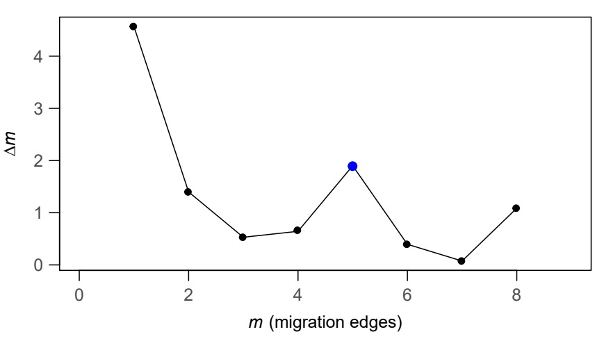
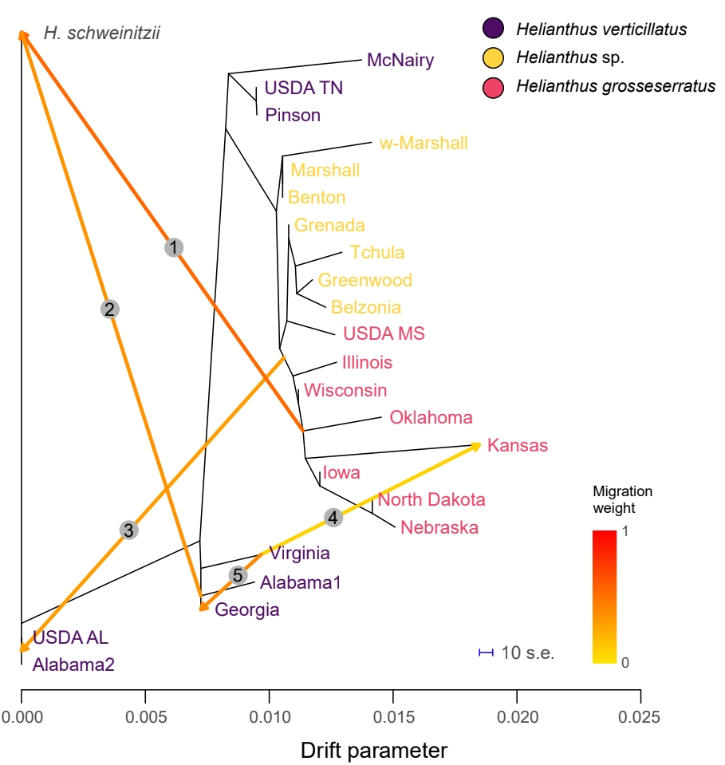
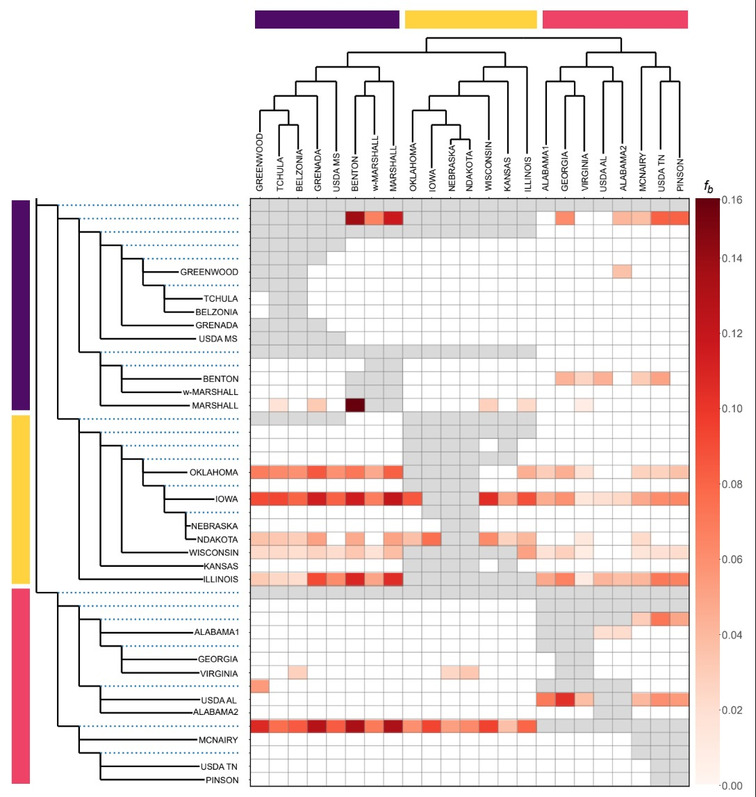

^1^ Department of Biological Sciences, University of Memphis, 3700 Walker Ave, Memphis, Tennessee 38152, USA

^2^ Department of Ecology & Evolutionary Biology, University of Connecticut, 75 N Eagleville Rd, Unit 3043, Storrs, CT 06269, USA

^3^ ACRE: Institute for Agricultural and Conservation Research and Education, University of Memphis, Memphis, Tennessee 38152, USA

\* Corresponding authors:
Samantha G. Drewry (sdrewry@memphis.edu);
Jennifer R. Mandel (jmandel@memphis.edu)

```{r setup, include=FALSE}
knitr::opts_chunk$set(echo = TRUE)

# Load required packages
library(leaflet)
library(dplyr)
library(htmltools)
library(sf)
library(htmlwidgets)

# Load in required dataset
Helianthus_sp_Locations <- read.csv("Helianthus sp. Locations.csv")
```

# Introduction

Genome-wide SNP datasets provide several advantages over microsatellite markers for population and conservation genomic studies. Whereas microsatellite analyses typically rely on a relatively small number of highly polymorphic loci [@guichoux2011], target-capture sequencing can generate thousands of SNPs distributed across hundreds of loci [@grover2012], substantially increasing statistical power for estimating genetic diversity, detecting fine-scale population structure, and inferring demographic history and gene flow. This expanded genomic representation also enables analyses that are difficult or impossible with microsatellite datasets, including tests of historical introgression and migration using approaches such as TreeMix and f-statistics, providing novel information for these groups. 

Although reduced-representation approaches such as Restriction-site-Associated DNA sequencing (RADseq) similarly generate genome-wide SNPs, target-capture offers several practical advantages, including more consistent recovery of homologous loci across samples, improved reproducibility among sequencing runs and studies, and compatibility with lower-quality or degraded DNA [@bose2018], making it particularly well suited for conservation applications and non-model taxa. Together, these advantages demonstrate that target-capture datasets can serve as a powerful resource for population genomic analyses while also leveraging data originally generated for phylogenomic studies.

# Applicability to this Workflow 

In this study, we demonstrate an accessible and reproducible workflow for generating and analyzing SNP datasets derived from target-capture sequencing data in a conservation genomics framework. Using *H. verticillatus* and its relatives as a case study, we evaluate genetic diversity and population structure across multiple previously known and newly discovered populations in Mississippi (hereafter referred to as *Helianthus* sp.), and compare our results with previous conservation genetic analyses based on microsatellites. By providing a transparent pipeline that can be applied to any species or target-capture probe set, this study illustrates how target-capture datasets can be leveraged to address conservation genomic questions and inform management decisions for rare and endangered species.


# Sampling

Leaf tissue was sampled from all known wild populations of *Helianthus verticillatus*: Alabama1, Alabama2, Georgia, McNairy (Tennessee), Pinson (Tennessee), w-Marshall (Mississippi), and Virginia. Seeds were obtained from the two available accessions of *H. verticillatus* maintained by the United States Department of Agriculture–Agricultural Research Service (USDA-ARS). Leaf tissue was sampled from all known populations of *Helianthus* sp. in Mississippi: Belzonia, Benton, Greenwood, Grenada, Marshall, and Tchula. Additionally, seeds were obtained from eight USDA-ARS accessions of *H. grosseserratus* populations, spanning its geographic range: Illinois, Iowa, Kansas, Mississippi, Nebraska, North Dakota, Oklahoma, and Wisconsin. Some downstream analyses require the inclusion of an outgroup, so a single individual of *Helianthus schweinitzii* Torr. & A.Gray was included.

The sampling map features the *H. verticillatus* population locations at their county centroids, since the species is federally endangered and exact locality information cannot be shared.

```{r heli_map, echo = FALSE, out.width="100%", out.height="1000px"}
Helianthuspalette <- colorFactor(
  palette = c("#EE4266", "#FFD23F", "#540D6E"),
  reverse = FALSE,
  domain = Helianthus_sp_Locations$Species,
  na.color = "transparent"
)

# Prepare tooltip text
Helianthusmytext <- paste(
  "<strong>Population Name: </strong>",
  Helianthus_sp_Locations[,1],
  "<br/>",
  "<strong>Species Identity: </strong><em>",
  Helianthus_sp_Locations$Species,
  "</em>",
  "<br/>",
  "<strong>Coordinate Precision: </strong>",
  Helianthus_sp_Locations[,4],
  sep = ""
) %>%
  lapply(htmltools::HTML)

Helianthusmap1 <- leaflet(Helianthus_sp_Locations) %>%
  addTiles() %>%
  setView(lng = -90.184813, lat = 40, zoom = 5) %>%
  addProviderTiles("Esri.WorldTopoMap", group = "Esri.WorldTopoMap") %>%
  addCircleMarkers(
    ~Longitude,
    ~Latitude,
    fillColor = ~Helianthuspalette(Species),
    fillOpacity = 1,
    color = "black",
    radius = 8,
    stroke = TRUE,
    label = Helianthusmytext,
    labelOptions = labelOptions(
      style = list(
        "font-weight" = "normal",
        padding = "3px 8px"
      ),
      textsize = "13px",
      direction = "auto"
    )
  ) %>%
  addLegend(
    pal = Helianthuspalette,
    values = ~Species,
    opacity = 1,
    title = "Species",
    position = "bottomright",
    labFormat = labelFormat(
      transform = function(x) {
        lapply(paste0("<em>", x, "</em>"), htmltools::HTML)
      }
    )
  )
Helianthusmap1
```

# Using this Guide

Here are some tips for utilizing this guide.

---

**Programming Languages**

Throughout this guide, code chunks are labeled according to the programming language in which they should be executed. Commands enclosed in `bash` code blocks are intended to be run from a Linux command line or high-performance computing (HPC) environment, whereas code enclosed in `r` code blocks should be executed within R or RStudio. This guide was developed using R version 4.3.2. Distinguishing between these environments is intended to provide readers with clear guidance on where each step of the workflow should be performed.

---

**Recommended Directory Structure**

Before beginning the workflow, establish a consistent project directory structure. Organizing inputs, intermediate files, and outputs in a standardized way improves reproducibility and makes it easier to trace each analysis step.

All commands in this workflow assume the following directory structure.

```text
Project/
├── Tools/
│   ├── FastQC/
│   ├── MultiQC/
│   ├── Trimmomatic/
│   ├── Bowtie2/
│   ├── SAMtools/
│   ├── BCFtools/
│   ├── PLINK/
│   ├── PHYLIP/
│   ├── ADMIXTURE/
│   ├── TreeMix/
│   ├── Dsuite/
│   └── AdmixTools/
│
├── RawReads/
│   ├── Sample1_R1.fastq.gz
│   ├── Sample1_R2.fastq.gz
│   └── ...
│
├── FastQCRaw/
├── Trimming/
├── FastQCTrimmed/
├── ReferenceGenome/
│   ├── ReferenceGenome.fasta
│   └── ReferenceGenome.*
│
├── Alignment/
│   ├── LDInvestigation/
│   └── SNPdataset_FinalFiltered.vcf.gz
│
├── OutgroupDataset/
│   └── OutgroupDataset_FinalFiltered.vcf.gz
│
├── SpeciesSpecificDatasets/
│   ├── Species1_FinalFiltered.vcf.gz
│   ├── Species2_FinalFiltered.vcf.gz
│   └── Species3_FinalFiltered.vcf.gz
│
├── PCA/
├── ADMIXTURE/
├── NJTree/
├── GeneticDiversity/
├── TreeMix/
├── F3Statistics/
└── Dsuite/
```

--- 

**Software Installation**

Throughout this workflow, various software are utilized. Users should replace these paths with the location of the software on their system. For simplicity, this protocol assumes users working on high-performance computing (HPC) systems and can load software through environment modules.

Examples:

```
module load bcftools
module load plink
module load R
```

Software that cannot be loaded through an environmental module should be installed according to the instructions provided for each package.

---

**Input Data Requirements**

This workflow assumes paired-end Illumina sequencing data in compressed `.FASTQ` format.

Required files for each sample:

```
Sample_R1.fastq.gz
Sample_R2.fastq.gz
```

Sample names should remain consistent throughout the workflow. Avoid renaming files after analyses have begun.

---


**Workflow Overview**

The pipeline branches into analysis-specific datasets after SNP calling and filtering:


```{r, echo=FALSE, fig.align='center', out.width="100%"}
knitr::include_graphics("./figures/Workflow Diagram.jpeg")
```


---

**Reproducibility Recommendations**

To maximize reproducibility, the user should:

- Record software versions used throughout the workflow.
- Maintain the recommended directory structure.
- Use consistent sample names across all files.

Documenting software versions is strongly recommended. For example:

```
bcftools --version
plink --version
R --version
```

These version numbers should be reported alongside published results whenever possible.

---

# Prepare Reads for Alignment

## Evaluate Raw Read Quality

Before beginning downstream analyses, assess the quality of raw sequencing reads. FASTQ files commonly contain adapter contamination and low-quality bases, which can negatively affect read alignment and SNP calling.

We use `FastQC` to generate per-sample quality reports and `MultiQC` to summarize results across all samples.

---

**Software and Dependencies**

This step uses the following tools:

* [`FastQC`](https://www.bioinformatics.babraham.ac.uk/projects/fastqc/) [@andrews2010] – evaluates raw and trimmed read quality
* [`MultiQC`](https://docs.seqera.io/multiqc/) [@ewels2016] – summarizes quality-control reports across samples

---

**Inputs**

For each sample, two compressed FASTQ files are required:

- `Sample_R1.fastq.gz` — forward reads
- `Sample_R2.fastq.gz` — reverse reads

These should be stored in `/Project/RawReads/`.

---

**Outputs**

The following files are written to `/Project/FastQCRaw/`:

- `*_fastqc.html`, `*_fastqc.zip` — individual `FastQC` reports
- `multiqc_report.html` — combined `MultiQC` report

---

**Code**

Create a folder for `FastQC` results in `/Project/`, and move into this folder:

```bash
# bash
mkdir /Project/FastQCRaw/
cd FastQCRaw
```

Run `FastQC` on all FASTQ files:

```bash
# bash
fastqc /Project/RawReads/*.fastq.gz -o .
```

Aggregate results using `MultiQC`:

```bash
# bash
multiqc . -o .
```

Open the resulting `multiqc_report.html` file in a web browser to review results.

---

**Interpretation of `FastQC` Metrics**

| Metric | What to Look For |
|:---:|:---:|
| Per-base sequence quality | Most bases should have Phred scores > 20 |
| Adapter content | Presence of adapters indicates trimming is needed |
| Per-sequence GC content | Should match the expected distribution for the organism |
| Sequence duplication levels | High duplication may indicate PCR bias |

---

## Remove Adapters and Low-Quality Reads

After evaluating raw read quality, remove adapter sequences and low-quality bases using `Trimmomatic`. This step improves downstream alignment and variant calling by retaining only high-quality sequence data.

---

**Software and Dependencies**

This step uses the following tool:

* [`Trimmomatic`](http://www.usadellab.org/cms/?page=trimmomatic) [@bolger2014] – removes adapters and low-quality bases from raw sequencing reads

---

**Inputs**

Like the previous step, two compressed FASTQ files are required for each sample:

- `Sample_R1.fastq.gz` — forward reads
- `Sample_R2.fastq.gz` — reverse reads

These should be the original raw FASTQ files, which are located in `/Project/RawReads/`.

---

**Outputs**

The following files are written to `/Project/Trimming/`:

| File | Description |
|:---:|:---:|
| `*_R1.tp.fastq.gz` | Forward reads that remain paired after trimming |
| `*_R2.tp.fastq.gz` | Reverse reads that remain paired after trimming |
| `*_R1.tunp.fastq.gz` | Forward reads whose pair was removed during trimming |
| `*_R2.tunp.fastq.gz` | Reverse reads whose pair was removed during trimming |

Most downstream analyses use only the paired reads (`*.tp.fastq.gz`).

---

**Trimming Parameters**

The following trimming parameters are applied:

| Parameter | Description |
|:---:|:---:|
| `ILLUMINACLIP:TruSeq3-PE.fa:2:30:10` | Removes Illumina TruSeq adapter sequences |
| `LEADING:20` | Removes low-quality bases (`Q < 20`) from the beginning of reads |
| `TRAILING:20` | Removes low-quality bases (`Q < 20`) from the end of reads |
| `SLIDINGWINDOW:5:20` | Trims when average quality in a 5-bp window drops below Q20 |
| `MINLEN:36` | Discards reads shorter than 36 bp after trimming |

---

**Code**

Create a folder for trimming in `/Project/`, and move into this folder:

```bash
# bash
mkdir /Project/Trimming/
cd Trimming
```

This loop processes all paired-end samples present in the `/Project/RawReads/` folder:

```bash
# bash
for fileR1 in /Project/RawReads/*_R1.fastq.gz
do

  fileR2=${fileR1/_R1.fastq.gz/_R2.fastq.gz}
  base=$(basename ${fileR1} _R1.fastq.gz)

  java -jar /Project/Tools/Trimmomatic/Trimmomatic.jar PE -threads 4 \
    ${fileR1} ${fileR2} \
    ${base}_R1.tp.fastq.gz ${base}_R1.tunp.fastq.gz \
    ${base}_R2.tp.fastq.gz ${base}_R2.tunp.fastq.gz \
    ILLUMINACLIP:/Project/Tools/Trimmomatic/adapters/TruSeq3-PE.fa:2:30:10 \
    LEADING:20 \
    TRAILING:20 \
    SLIDINGWINDOW:5:20 \
    MINLEN:36

done
```

---

## Confirm Quality After Trimming

After trimming, reassess read quality to confirm that adapter contamination and low-quality bases have been successfully removed. This step ensures that only high-quality reads proceed to alignment and downstream analyses.

We use `FastQC` on the trimmed reads to generate per-sample quality reports and `MultiQC` to summarize results across all samples.

---

**Software and Dependencies**

This step uses the following tools:

* [`FastQC`](https://www.bioinformatics.babraham.ac.uk/projects/fastqc/) [@andrews2010] – evaluates raw and trimmed read quality
* [`MultiQC`](https://docs.seqera.io/multiqc/) [@ewels2016] – summarizes quality-control reports across samples

---

**Inputs**

Trimmed paired-end reads located in `/Project/Trimming/`:

- `*_R1.tp.fastq.gz` — forward reads
- `*_R2.tp.fastq.gz` — reverse reads

---

**Outputs**

The following files are written to `/Project/FastQCTrimmed/`:

- `*_fastqc.html`, `*_fastqc.zip` — individual `FastQC` reports
- `multiqc_report.html` — combined `MultiQC` report

---

**Code**

Create a folder for `FastQC` on the trimmed reads in `/Project/`, and move into this folder:

```bash
# bash
mkdir /Project/FastQCTrimmed/
cd FastQCTrimmed
```

Run `FastQC` on all trimmed FASTQ files:

```bash
# bash
fastqc /Project/Trimming/*.tp.fastq.gz -o .
```

Summarize the results with `MultiQC`:

```bash
# bash
multiqc . -o .
```

---

**Interpretation**

Compare the pre- and post-trimming `MultiQC` reports:

- Reduced or eliminated adapter contamination
- Improved per-base sequence quality scores
- Reduced low-quality tail regions
- More consistent GC distribution, if previously affected by artifacts

---

# Align Reads to the Reference Genome

After trimming, align sequencing reads to a reference genome to determine their likely genomic origin. This step is required for downstream SNP discovery and genotyping.

For this study, reads were aligned to the *Helianthus annuus* reference genome (Ha412HOv2.0), available from the Sunflower Genome Database (https://sunflowergenome.org/) [@badouin2017; @huang2023; @todesco2020]. A reference genome is not currently available for either *H. grosseserratus* or *H. verticillatus*, so *H. annuus* was used as the closest available high-quality reference assembly.

Choose a reference genome appropriate for your study system. A great resource to find which genomes are currently available for your system is [PubPlant](https://www.plabipd.de/plant_genomes_pa.ep).

---

**Software and Dependencies**

This step uses the following tools:

* [`Bowtie2`](https://bowtie-bio.sourceforge.net/bowtie2/manual.shtml) [@langmead2012] – indexes the reference genome and aligns paired-end reads to the reference genome
* [`SAMtools`](https://www.htslib.org/doc/samtools.html) [@li2009; @danecek2021] – converts, sorts, indexes, and processes SAM/BAM alignment files

---

**Inputs**

Located in `/Project/ReferenceGenome/`:

- `ReferenceGenome.fasta` — reference genome

Located in `/Project/Trimming/`:

- `*_R1.tp.fastq.gz`, `*_R2.tp.fastq.gz` — trimmed paired-end reads

---

**Outputs**

The following files are written to `/Project/ReferenceGenome/`:

- `Bowtie2` index files (`ReferenceGenome.*.bt2`)

The following files are written to `/Project/Alignment/`:

- Sorted alignment files (`*.bam`)
- BAM index files (`*.bai`)

---

## Index the Reference Genome

Before reads are aligned, index the reference genome, which creates files that allow the alignment software to efficiently search the genome.

---

**Code**

Create a folder to store the reference genome files in `/Project/`, and move into this folder:

```bash
# bash
mkdir /Project/ReferenceGenome/
cd ReferenceGenome
```

Move the reference genome into this folder:

```bash
# bash
mv /path/to/ReferenceGenome.fasta /Project/ReferenceGenome/
```

Index the reference genome using `Bowtie2` to enable efficient read alignment:

```bash
# bash
bowtie2-build ReferenceGenome.fasta ReferenceGenome
```

This generates a set of indexed files with the prefix `ReferenceGenome`, which `Bowtie2` uses to rapidly search the genome during alignment.

---

## Align Trimmed Reads

Align the trimmed paired-end reads to the indexed reference genome. Only the paired trimmed reads (`*.tp.fastq`) are used in this workflow. Reads that became unpaired during trimming are excluded from the alignment. To avoid duplicating large files, the trimmed reads remain in the `/Project/Trimming/` folder and are referenced directly during alignment.

---

**Alignment Parameters Used**

The following alignment parameters are applied:

| Parameter | Description |
|:---:|:---:|
| `--end-to-end` | Requires the entire read to align to the reference |
| `--sensitive` | Preset that increases alignment sensitivity |
| `-p 24` | Uses 24 CPU threads to speed up alignment |
| `-x` | Specifies the `Bowtie2` reference genome index |
| `-1` | Forward read file |
| `-2` | Reverse read file |
| `-S` | Output alignment file in SAM format |

---

**Code**

Create a folder to store the alignment files in `/Project/`, and move into this folder:

```bash
# bash
mkdir /Project/Alignment/
cd Alignment
```

Align paired-end reads using `Bowtie2`, and process the alignments using `SAMtools`:

```bash
# bash
for file1 in /Project/Trimming/*R1.tp.fastq.gz
do
    file2=${file1/R1/R2}
    filename=$(basename ${file1%%_R*})
    outputpath=/Project/Alignment/

    bowtie2 --end-to-end --sensitive -p 24 \
        -x /Project/ReferenceGenome/ReferenceGenome \
        -1 "$file1" -2 "$file2" \
        -S "${outputpath}${filename}.sam" &&

    samtools view -bS "${outputpath}${filename}.sam" | \
    samtools sort -o "${outputpath}${filename}.bam" &&

    samtools index "${outputpath}${filename}.bam"
done
```

---

**Understanding the Alignment Process**

During alignment, `Bowtie2` compares each sequencing read to the reference genome and determines the most likely genomic location of origin.

An alignment represents how a sequencing read matches a region of the reference genome. For example:

```text
Sequencing Read:   GACTGGGCGATCTCGACTTCG
                   |||||  |||||||||| |||
Reference Genome:  GACTG--CGATCTCGACATCG
```

Vertical bars (`|`) indicate matching bases, while dashes (`-`) represent gaps introduced during alignment.

This process allows reads to be placed at specific genomic positions, which is essential for identifying genetic variation such as SNPs.

---

# Call and Filter SNPs

Single nucleotide polymorphisms (SNPs) are one of the most widely used genetic markers in population genomics. After aligning reads to the reference genome, identify variant sites across all samples using `BCFtools`.

---

**Software and Dependencies**

This step uses the following tools:

* [`Bowtie2`](https://bowtie-bio.sourceforge.net/bowtie2/manual.shtml) [@langmead2012] – indexes the reference genome and aligns paired-end reads to the reference genome
* [`SAMtools`](https://www.htslib.org/doc/samtools.html) [@li2009; @danecek2021] – converts, sorts, indexes, and processes SAM/BAM alignment files
* [`PLINK`](https://www.cog-genomics.org/plink/1.9/) [@chang2015] – converts genotype formats, filters SNPs, performs LD pruning, and calculates genetic distances
* [`R`](https://www.r-project.org/) [@r2021] – processes PLINK LD output to calculate SNP distances, bin pairwise comparisons, and summarize mean r² values for LD decay visualization
* [`dplyr`](https://dplyr.tidyverse.org/) [@wickham2023] – assists with data wrangling and distance-bin assignment

---

**Inputs**

Located in `/Project/Alignment/`:

- `*.bam` — aligned and sorted reads
- `*.bai` — BAM index files

Located in `/Project/ReferenceGenome/`:

- `ReferenceGenome.fasta` — reference genome

---

**Outputs**

The following files are written to `/Project/Alignment/`:

- `SNPdataset_raw.vcf.gz` — raw SNP calls
- `SNPdataset_FinalFiltered.vcf.gz` — filtered SNP calls

---

## Call Raw SNPs

Identify variants using the `BCFtools` functions `mpileup` and `call` by comparing aligned reads in the BAM files to the reference genome.

---

**Code**

Call SNPs in the `/Project/Alignment/` folder:

```bash
# bash
bcftools mpileup -Ou -f /Project/ReferenceGenome/ReferenceGenome.fasta *.bam | bcftools call -mv -Oz -o SNPdataset_raw.vcf.gz
```

Index the VCF for fast access:

```bash
# bash
bcftools index SNPdataset_raw.vcf.gz
```

---

**Parameters Used**

The following parameters are applied:

| Parameter | Description |
|:---:|:---:|
| `-f` | Specifies the reference genome in FASTA format |
| `-Ou` | Outputs an uncompressed BCF stream suitable for piping into the `call` command |
| `-v` | Restricts output to variant sites only |
| `-m` | Uses the multiallelic variant caller |
| `-Oz` | Outputs a bgzip-compressed VCF |

The output `SNPdataset_raw.vcf.gz` contains all variant sites identified in the dataset.

---

## Fix Missing Genotypes

Some VCF files have genotypes like `0/0:0,0,0` that `BCFtools` does not recognize as missing. Reformat these to `./.` before filtering can begin.

---

**Code**

Reformat missing genotypes:

```bash
# bash
bcftools view -H SNPdataset_raw.vcf.gz | \
perl -F'\t' -lane '
    for($i=9; $i<=$#F; $i++) {
        $F[$i] =~ s/(0\/0|0\/1|1\/1):0,0,0/.\/.:./;
    }
    print join("\t", @F);
' > SNPdataset_01_fix_missingGT_temp.vcf
```

Reattach the VCF header:

```bash
# bash
bcftools view -h SNPdataset_raw.vcf.gz > SNPdataset_raw.header.txt
cat SNPdataset_raw.header.txt SNPdataset_01_fix_missingGT_temp.vcf > SNPdataset_01_fix_missingGT.vcf
rm SNPdataset_01_fix_missingGT_temp.vcf
```

Verify that no incorrect missing genotypes remain:

```bash
# bash
grep '0/0:0,0,0\|0/1:0,0,0\|1/1:0,0,0' SNPdataset_01_fix_missingGT.vcf
```

If this command returns any output, an error remains in the file and will need to be investigated further.

---

## Filter SNPs

To retain high-quality and informative variants, the following filters are applied:

1. Read depth (`DP >= 4`) — ensures sufficient sequencing support
2. Quality (`QUAL >= 20`) — removes low-confidence calls
3. Biallelic SNPs — removes invariant sites and indels
4. Missing data (`≤ 0.25`) — removes poorly genotyped loci
5. Minor allele frequency (`MAF > 0.01`) — removes rare variants
6. Linkage disequilibrium (`r² < 0.2`) — removes non-independent loci

**Notes:**

- Users should adjust filter thresholds (`DP`, `QUAL`, `MAF`, LD) according to their organism and sequencing design.

---

**Code**

Filter by depth and quality:

```bash
# bash
bcftools filter -i 'DP>=4 && QUAL>=20' -O z -o SNPdataset_02_DP4_QUAL20.vcf.gz SNPdataset_01_fix_missingGT.vcf
```

Keep biallelic SNPs only:

```bash
# bash
bcftools filter -e 'AC==0 || AC==AN' SNPdataset_02_DP4_QUAL20.vcf.gz | bcftools view -m2 -M2 -v snps -O z -o SNPdataset_03_biallelic_snps.vcf.gz
```

Filter by missing data:

```bash
# bash
bcftools view -H SNPdataset_03_biallelic_snps.vcf.gz | \
awk -F'\t' '
{
    missing = 0;
    total = 0;
    for (i=10; i<=NF; i++) {
        if ($i ~ /\.\/\.:./) {
            missing++;
        }
        total++;
    }
    if (total > 0) {
        fraction_missing = missing / total;
        if (fraction_missing <= 0.25) {
            print $0;
        }
    }
}' > SNPdataset_04_missingdata_body.vcf

bcftools view -h SNPdataset_03_biallelic_snps.vcf.gz > SNPdataset_03_biallelic_snps_header.txt
cat SNPdataset_03_biallelic_snps_header.txt SNPdataset_04_missingdata_body.vcf > SNPdataset_04_missingdata.vcf
rm SNPdataset_04_missingdata_body.vcf
```

Filter by minor allele frequency (MAF):

```bash
# bash
bcftools +fill-tags SNPdataset_04_missingdata.vcf -- -t MAF | \
bcftools view -i 'MAF>0.01' -Oz -o SNPdataset_05_MAF01.vcf.gz
```

---

**Investigate Population-Level Linkage Disequilibrium**

Many population genetic analyses assume that genetic markers are independent. However, SNPs located near each other on a chromosome may be in linkage disequilibrium (LD), meaning they are correlated due to physical proximity or shared inheritance.

To account for this, SNP datasets are often thinned based on LD. Selecting an appropriate LD threshold is critical and should be informed by the biology of the study system. If an appropriate threshold is unknown, LD decay can be estimated for each population.

---

**Code**

Create a folder for LD investigation within the `/Project/Alignment/` folder, and move into this folder:

```bash
# bash
mkdir /Project/Alignment/LDInvestigation/
cd LDInvestigation
```

Create a folder for the first population within `/Project/Alignment/LDInvestigation/`, and move into this folder:

```bash
# bash
mkdir /Project/Alignment/LDInvestigation/POPULATION1
cd POPULATION1
```

Extract samples belonging to a single population:

```bash
# bash
bcftools view -s POPULATION1_SAMPLE1,POPULATION1_SAMPLE2,POPULATION1_SAMPLE3 -o POPULATION1.vcf /Project/Alignment/SNPdataset_05_MAF01.vcf.gz
```

Convert the VCF to PLINK format:

```bash
# bash
plink --make-bed --vcf POPULATION1.vcf --out POPULATION1 --allow-extra-chr
```

Calculate LD by population:

```bash
# bash
plink --r2 --ld-window-r2 0 --ld-window 999999 --ld-window-kb 1000 -bfile POPULATION1 --allow-extra-chr
```

This generates a `plink.ld` file containing pairwise LD estimates (r²) between SNPs. Open an `R` environment and load the required packages:

```r
# r
library(dplyr)
library(ggplot2)
```

Read in the `plink.ld` table:

```r
# r
LD <- read.table("plink.ld", header = TRUE)
```

Create custom breaks:

```r
# r
breaks_kb <- c(
  0, 0.05, 0.1, 0.25, 0.5, 0.75, 1, 1.25,
  2.5, 3.75, 5, 7.5, 10, 15, 20, 30, 40,
  60, 80, 115, 150, 212.5, 275, 387.5,
  500, 737.5, 975, 1000
)
```

Create a table that includes the mean r² within the distance bins:

```r
# r
LD_decay <- LD %>%
  mutate(
    distance_kb = (BP_B - BP_A) / 1000,
    bin = cut(distance_kb, breaks = breaks_kb, include.lowest = TRUE)
  ) %>%
  group_by(bin) %>%
  summarise(
    mean_r2 = mean(R2, na.rm = TRUE),
    n_pairs = n(),
    .groups = "drop"
  ) %>%
  mutate(
    lower_kb = breaks_kb[-length(breaks_kb)],
    upper_kb = breaks_kb[-1],
    midpoint_kb = (lower_kb + upper_kb) / 2
  )
```

Save the LD decay table:

```r
# r
write.csv(LD_decay, "POPULATION1_LD_decay_table.csv", row.names = FALSE)
```

Plot the LD decay curve:

```r
# r
pdf("POPULATION1_LD_decay.pdf", width = 7, height = 5)

plot(
  LD_decay$midpoint_kb,
  LD_decay$mean_r2,
  type = "b",
  pch = 19,
  xlab = "Distance between SNPs (kb)",
  ylab = expression(mean~r^2),
  main = "LD Decay for POPULATION1"
)

dev.off()
```

Example:

```{r, echo=FALSE, fig.align='center', out.width="70%"}
knitr::include_graphics("./figures/LD Curve.jpeg")
```

Repeat this process for each population.

Plotting r² vs. distance allows visualization of LD decay within each population.

---

**Interpretation**

- LD typically decreases as physical distance between SNPs increases.
- The distance at which r² stabilizes or drops below a threshold informs pruning decisions.
- In this study, an LD threshold of r² = 0.2 was selected as biologically appropriate.

Users should determine an appropriate threshold based on their organism and dataset.

---

**Prune SNPs Based on Linkage Disequilibrium**

After selecting an LD threshold, prune SNPs to retain approximately independent markers.

---

**Code**

Move back into the `/Project/Alignment/` folder:

```bash
# bash
cd /Project/Alignment/
```

Set SNP IDs to `CHROM_POS` for `PLINK` compatibility:

```bash
# bash
bcftools annotate --set-id '%CHROM\_%POS' -o SNPdataset_05_MAF01_fixed.vcf -O v SNPdataset_05_MAF01.vcf.gz
```

Perform LD pruning:

```bash
# bash
plink --vcf SNPdataset_05_MAF01_fixed.vcf --indep-pairwise 50 10 0.2 --out thinned_snps --allow-extra-chr
```

Extract SNPs to retain:

```bash
# bash
awk '{split($1, arr, "_"); print arr[1], arr[2]}' OFS='\t' thinned_snps.prune.in > snps_to_keep.txt
```

Generate the final filtered VCF:

```bash
# bash
bcftools view -T snps_to_keep.txt -o SNPdataset_FinalFiltered.vcf.gz -O z SNPdataset_05_MAF01_fixed.vcf
```

---

**Tracking Filtering Steps**

The intermediate file naming system (e.g., `01_fix_missingGT`, `03_biallelic_snps`) allows users to track how each filtering step affects the dataset.

To summarize SNP statistics at any stage:

```bash
# bash
bcftools stats -s - SNPdataset_03_biallelic_snps.vcf.gz
```

---

**Final Output and Downstream Use**

The final filtered dataset, `SNPdataset_FinalFiltered.vcf.gz`, represents a high-confidence set of SNPs that have been processed through multiple quality-control and filtering steps. Specifically, this dataset:

- Retains only high-quality variant calls after depth and quality filtering.
- Includes only biallelic SNPs suitable for population genetic analyses.
- Minimizes missing data across samples.
- Excludes rare variants that may represent sequencing artifacts.
- Contains loci that are approximately independent following LD pruning.

By retaining intermediate files throughout the pipeline, users can also evaluate how each filtering step impacts SNP retention and adjust parameters as needed for their specific study system.

Together, these filtering steps ensure that the dataset is suitable for downstream population genomic analyses. This filtered dataset is hereafter referred to as the “Ingroup dataset,” as it includes all study individuals except the outgroup taxon.

---

# Generate an Outgroup Dataset

Some downstream population genomic analyses (e.g., `TreeMix`, ABBA-BABA tests) require the inclusion of an outgroup to infer the direction of allele frequency changes and root population relationships. An outgroup is a sample or population that is phylogenetically outside the group of interest but still closely related enough to allow meaningful comparison.

Process the outgroup dataset using the same pipeline described above, with modifications to the SNP filtering steps.

---

**Software and Dependencies**

This step uses the following tools:

* [`FastQC`](https://www.bioinformatics.babraham.ac.uk/projects/fastqc/) [@andrews2010] – evaluates raw and trimmed read quality
* [`MultiQC`](https://docs.seqera.io/multiqc/) [@ewels2016] – summarizes quality-control reports across samples
* [`Trimmomatic`](http://www.usadellab.org/cms/?page=trimmomatic) [@bolger2014] – removes adapters and low-quality bases from raw sequencing reads
* [`Bowtie2`](https://bowtie-bio.sourceforge.net/bowtie2/manual.shtml) [@langmead2012] – indexes the reference genome and aligns paired-end reads to the reference genome
* [`SAMtools`](https://www.htslib.org/doc/samtools.html) [@li2009; @danecek2021] – converts, sorts, indexes, and processes SAM/BAM alignment files

---

**Filtering Strategy for Outgroup Analyses**

Unlike datasets prepared for analyses of genetic diversity, SNP filtering for outgroup-based analyses should be more conservative:

|                 **Pipeline Step**                | **Apply** | **Notes**                                                                                                                                           |
| :----------------------------------------------: | :-------: | :--------------------------------------------------------------------------------------------------------------------------------------------------: |
|           Alignment to reference genome          |    Yes    | Must be performed consistently for all ingroup and outgroup samples.                                                                                |
| SNP calling (`bcftools mpileup`/`bcftools call`) |    Yes    | Include the outgroup during variant calling so SNPs are called jointly across all samples.                                                          |
|            Depth and quality filtering           |    Yes    | Retains only reliable SNPs supported by sufficient read depth and variant quality.                                                                  |
|              Biallelic SNP filtering             |    Yes    | Retains biallelic SNPs and removes indels and multiallelic sites, which are not accepted by many downstream population genomic tools.               |
|              Missing data filtering              |    Yes    | Apply a moderate threshold to reduce missingness while avoiding excessive removal of informative sites.                                             |
|      Minor allele frequency (MAF) filtering      |   **No**  | Rare alleles may be informative for resolving relationships among ingroup and outgroup samples and should not be removed from the outgroup dataset. |
|       Linkage disequilibrium (LD) filtering      |  Yes  | Apply LD pruning to reduce non-independence among tightly linked SNPs while retaining genome-wide ancestry and allele-frequency information.        |

For the outgroup dataset, LD filtering was applied, but MAF filtering was not applied, allowing rare variants to be retained while reducing redundancy among highly correlated SNPs.

---

**Inputs**

For each outgroup sample, two compressed FASTQ files are required:

- `Outgroup_R1.fastq.gz` — forward reads
- `Outgroup_R2.fastq.gz` — reverse reads

Located in `/Project/Alignment/`:

- `*.bam` — aligned BAM files for all ingroup samples

Located in `/Project/ReferenceGenome/`:

- `ReferenceGenome.fasta` — reference genome

---

**Outputs**

The following file is written to `/Project/OutgroupDataset/`:

- `Outgroup_SNPdataset_FinalFiltered.vcf.gz`

---

## Recommended Workflow

To generate a dataset suitable for outgroup-based analyses, follow the workflow outlined below. It is similar to the workflow described previously, with modifications to the SNP filtering step.

---

**Code**

Create a folder for the outgroup dataset (`/Project/OutgroupDataset/`), move into it, and copy the raw outgroup sequencing reads (`.fastq.gz`) into the folder:

```bash
# bash
mkdir /Project/OutgroupDataset/
cd OutgroupDataset

cp /path/to/Outgroup.fastq.gz /Project/OutgroupDataset/
```

---

**Quality Check and Trim the Outgroup Sequencing Reads**

Run `FastQC` on the outgroup FASTQ files:

```bash
# bash
fastqc /Project/OutgroupDataset/*.fastq.gz -o .
```

Aggregate results using `MultiQC`:

```bash
# bash
multiqc FastQCRaw -o .
```

Open the resulting `multiqc_report.html` file in a web browser to review the results.

This loop trims all paired-end samples present in the `/OutgroupDataset/` folder:

```bash
# bash
for fileR1 in /Project/OutgroupDataset/*_R1.fastq.gz
do

  fileR2=${fileR1/_R1.fastq.gz/_R2.fastq.gz}
  base=$(basename ${fileR1} _R1.fastq.gz)

  java -jar /Project/Tools/Trimmomatic/Trimmomatic.jar PE -threads 4 ${fileR1} ${fileR2} ${base}_R1.tp.fastq.gz ${base}_R1.tunp.fastq.gz ${base}_R2.tp.fastq.gz ${base}_R2.tunp.fastq.gz \
  ILLUMINACLIP:/Project/Tools/Trimmomatic/adapters/TruSeq3-PE.fa:2:30:10 LEADING:20 TRAILING:20 SLIDINGWINDOW:5:20 MINLEN:36

done
```

---

**Align the Outgroup Sequencing Reads to the Reference Genome**

Align paired-end reads using `Bowtie2` and process the alignments using `SAMtools`:

```bash
# bash
for file1 in /Project/OutgroupDataset/*R1.tp.fastq.gz
do
    file2=${file1/R1/R2}
    filename=$(basename ${file1%%_R*})
    outputpath=/Project/OutgroupDataset/

    bowtie2 --end-to-end --sensitive -p 24 \
        -x /Project/ReferenceGenome/ReferenceGenome \
        -1 "$file1" -2 "$file2" \
        -S "${outputpath}${filename}.sam" &&

    samtools view -bS "${outputpath}${filename}.sam" | \
    samtools sort -o "${outputpath}${filename}.bam" &&

    samtools index "${outputpath}${filename}.bam"
done
```

---

**Call SNPs Across All Samples, Including the Outgroup**

Copy the BAM files from `/Project/Alignment/` into the `/OutgroupDataset/` folder temporarily:

```bash
# bash
cp /Project/Alignment/*.bam /Project/OutgroupDataset/
```

Call SNPs to create the raw dataset:

```bash
# bash
bcftools mpileup -Ou -f /Project/ReferenceGenome/ReferenceGenome.fasta *.bam | bcftools call -mv -Oz -o Outgroup_SNPdataset_raw.vcf.gz
```

Index the VCF for rapid access:

```bash
# bash
bcftools index Outgroup_SNPdataset_raw.vcf.gz
```

Remove the duplicated BAM files copied from `/Project/Alignment/` to preserve storage space. Do not delete the outgroup BAM files.

---

**Fix Missing Genotypes**

Reformat missing genotypes:

```bash
# bash
bcftools view -H Outgroup_SNPdataset_raw.vcf.gz | \
perl -F'\t' -lane '
    for($i=9; $i<=$#F; $i++) {
        $F[$i] =~ s/(0\/0|0\/1|1\/1):0,0,0/.\/.:./;
    }
    print join("\t", @F);
' > Outgroup_SNPdataset_01_fix_missingGT_temp.vcf
```

Reattach the VCF header:

```bash
# bash
bcftools view -h Outgroup_SNPdataset_raw.vcf.gz > Outgroup_SNPdataset_raw.header.txt
cat Outgroup_SNPdataset_raw.header.txt Outgroup_SNPdataset_01_fix_missingGT_temp.vcf > Outgroup_SNPdataset_01_fix_missingGT.vcf
rm Outgroup_SNPdataset_01_fix_missingGT_temp.vcf
```

Verify that no incorrect missing genotypes remain:

```bash
# bash
grep '0/0:0,0,0\|0/1:0,0,0\|1/1:0,0,0' Outgroup_SNPdataset_01_fix_missingGT.vcf
```

If this command returns any output, an error remains in the file.

---

**Apply Standard Quality Filters**

To retain high-quality and informative variants, apply the following filters:

1. Read depth (`DP >= 4`) — ensures sufficient sequencing support
2. Quality (`QUAL >= 20`) — removes low-confidence calls
3. Biallelic SNPs — removes invariant sites and indels
4. Missing data (`≤ 0.25`) — removes poorly genotyped loci
5. Linkage disequilibrium (`r² < 0.2`) — removes non-independent loci

Do not filter based on minor allele frequency.

Filter by depth and quality:

```bash
# bash
bcftools filter -i 'DP>=4 && QUAL>=20' -O z -o Outgroup_SNPdataset_02_DP4_QUAL20.vcf.gz Outgroup_SNPdataset_01_fix_missingGT.vcf
```

Keep biallelic SNPs only:

```bash
# bash
bcftools filter -e 'AC==0 || AC==AN' Outgroup_SNPdataset_02_DP4_QUAL20.vcf.gz | bcftools view -m2 -M2 -v snps -O z -o Outgroup_SNPdataset_03_biallelic_snps.vcf.gz
```

Filter by missing data:

```bash
# bash
bcftools view -H Outgroup_SNPdataset_03_biallelic_snps.vcf.gz | \
awk -F'\t' '
{
    missing = 0;
    total = 0;
    for (i=10; i<=NF; i++) {
        if ($i ~ /\.\/\.:./) {
            missing++;
        }
        total++;
    }
    if (total > 0) {
        fraction_missing = missing / total;
        if (fraction_missing <= 0.25) {
            print $0;
        }
    }
}' > Outgroup_SNPdataset_04_missingdata_body.vcf

bcftools view -h Outgroup_SNPdataset_03_biallelic_snps.vcf.gz > Outgroup_SNPdataset_03_biallelic_snps_header.txt
cat Outgroup_SNPdataset_03_biallelic_snps_header.txt Outgroup_SNPdataset_04_missingdata_body.vcf > Outgroup_SNPdataset_04_missingdata.vcf
rm Outgroup_SNPdataset_04_missingdata_body.vcf
```

Prune based on linkage disequilibrium:

```bash
# bash
bcftools annotate --set-id '%CHROM\_%POS' -o Outgroup_SNPdataset_04_missingdata_fixed.vcf -O v Outgroup_SNPdataset_04_missingdata.vcf

plink --vcf Outgroup_SNPdataset_04_missingdata_fixed.vcf --indep-pairwise 50 10 0.2 --out thinned_snps --allow-extra-chr

awk '{split($1, arr, "_"); print arr[1], arr[2]}' OFS='\t' thinned_snps.prune.in > snps_to_keep.txt

bcftools view -T snps_to_keep.txt -o Outgroup_SNPdataset_FinalFiltered.vcf.gz -O z Outgroup_SNPdataset_04_missingdata_fixed.vcf
```

This produces a dataset that preserves the full spectrum of genetic variation needed to infer ancestral states and population relationships. The output is the filtered outgroup dataset, `Outgroup_SNPdataset_FinalFiltered.vcf.gz`.

---

**Downstream Use**

This dataset is used for analyses that rely on rooted relationships or allele polarization, including:

- `TreeMix` (population splits and migration events)
- ABBA-BABA (*D*-statistics)
- *f*-statistics (*f4*-ratio and *f*-branch)

These methods depend on the outgroup to distinguish ancestral and derived alleles and to interpret patterns of gene flow.

---

# Generate Species-Specific Datasets

Several downstream analyses in this workflow focus on genetic diversity within species rather than among species. Examples include pairwise F<sub>ST</sub>, observed heterozygosity (H<sub>O</sub>), expected heterozygosity (H<sub>E</sub>), and inbreeding coefficients (F<sub>IS</sub>).

To ensure that allele frequencies and diversity statistics are estimated only from individuals belonging to a single species, separate species-specific datasets are generated prior to calculating genetic diversity statistics. Species-specific datasets are created by separating aligned `BAM` files by species and then performing SNP calling independently for each species.

---

**Software and Dependencies**

This step uses the following tools:

* [`FastQC`](https://www.bioinformatics.babraham.ac.uk/projects/fastqc/) [@andrews2010] – evaluates raw and trimmed read quality
* [`MultiQC`](https://docs.seqera.io/multiqc/) [@ewels2016] – summarizes quality-control reports across samples
* [`Trimmomatic`](http://www.usadellab.org/cms/?page=trimmomatic) [@bolger2014] – removes adapters and low-quality bases from raw sequencing reads
* [`Bowtie2`](https://bowtie-bio.sourceforge.net/bowtie2/manual.shtml) [@langmead2012] – indexes the reference genome and aligns paired-end reads to the reference genome
* [`SAMtools`](https://www.htslib.org/doc/samtools.html) [@li2009; @danecek2021] – converts, sorts, indexes, and processes `SAM`/`BAM` alignment files

---

**Filtering Strategy for Species-Separated Analyses**

|                 **Pipeline Step**                | **Apply** | **Notes**                                                                                                                                      |
| :----------------------------------------------: | :-------: | :---------------------------------------------------------------------------------------------------------------------------------------------: |
|           Alignment to reference genome          |    Yes    | Must be performed consistently for all individuals across datasets.                                                                            |
| SNP calling (`bcftools mpileup`/`bcftools call`) |    Yes    | Include all individuals within the focal species during variant calling.                                                                       |
|            Depth and quality filtering           |    Yes    | Retains only reliable SNPs supported by sufficient read depth and variant quality.                                                             |
|              Biallelic SNP filtering             |    Yes    | Retains biallelic SNPs and removes indels and multiallelic sites, which are not accepted by many downstream population genomic tools.          |
|              Missing data filtering              |    Yes    | Apply a moderate threshold to reduce missingness while retaining enough SNPs for within-species comparisons.                                   |
|      Minor allele frequency (MAF) filtering      |   **No**  | Rare alleles are informative for estimates of genetic diversity, including private alleles, heterozygosity, and population-specific variation. |
|       Linkage disequilibrium (LD) filtering      |   **No**  | LD pruning was not applied so that species-specific datasets retained the maximum number of informative SNPs for genetic diversity summaries.  |

For the species-separated datasets, neither MAF filtering nor LD filtering was applied because rare and linked variants may contribute to estimates of within-species genetic diversity and population-specific variation.

---

**Inputs**

Located in `/Project/Alignment/`:

- Species-specific `.bam` files

Located in `/Project/ReferenceGenome/`:

- `ReferenceGenome.fasta` — reference genome

---

**Outputs**

The species-separated datasets are written to `/Project/Alignment/`.

For example:

- `Species1_FinalFiltered.vcf.gz`
- `Species2_FinalFiltered.vcf.gz`
- `Species3_FinalFiltered.vcf.gz`

These VCF files are subsequently used in the Genetic Diversity Statistics section.

---

## Recommended Workflow

To generate species-separated datasets, follow the workflow outlined below. It is similar to the workflow described previously, with modifications to the SNP filtering step.

---

**Code**

Move into the `/Project/Alignment/` folder.

```bash
# bash
cd Alignment
```

---

**Call SNPs by Species**

Create a text file containing the BAM files for each species.

Example:

```text
Species1_bams.txt

Species1_Sample1.bam
Species1_Sample2.bam
Species1_Sample3.bam
```

Call SNPs using `bcftools mpileup` and `bcftools call` with only the BAM files belonging to a single species.

```bash
# bash
bcftools mpileup -Ou -f /Project/ReferenceGenome/ReferenceGenome.fasta -b Species1_bams.txt | bcftools call -mv -Oz -o Species1_SNPDataset_raw.vcf.gz
```

Index the VCF:

```bash
# bash
bcftools index Species1_SNPDataset_raw.vcf.gz
```

---

**Fix Missing Genotypes**

Reformat missing genotypes:

```bash
# bash
bcftools view -H Species1_SNPDataset_raw.vcf.gz | \
perl -F'\t' -lane '
    for($i=9; $i<=$#F; $i++) {
        $F[$i] =~ s/(0\/0|0\/1|1\/1):0,0,0/.\/.:./;
    }
    print join("\t", @F);
' > Species1_SNPDataset_01_fix_missingGT_temp.vcf
```

Reattach the VCF header:

```bash
# bash
bcftools view -h Species1_SNPDataset_raw.vcf.gz > Species1_SNPDataset_raw.header.txt
cat Species1_SNPDataset_raw.header.txt Species1_SNPDataset_01_fix_missingGT_temp.vcf > Species1_SNPDataset_01_fix_missingGT.vcf
rm Species1_SNPDataset_01_fix_missingGT_temp.vcf
```

Verify that no incorrect missing genotypes remain:

```bash
# bash
grep '0/0:0,0,0\|0/1:0,0,0\|1/1:0,0,0' Species1_SNPDataset_01_fix_missingGT.vcf
```

If this command returns any output, an error remains in the file.

---

**Apply Standard Quality Filters**

To retain high-quality and informative variants, apply the following filters:

1. Read depth (`DP >= 4`) — ensures sufficient sequencing support
2. Quality (`QUAL >= 20`) — removes low-confidence calls
3. Biallelic SNPs — removes invariant sites and indels
4. Missing data (`≤ 0.25`) — removes poorly genotyped loci

Do not filter based on minor allele frequency and do not prune SNPs based on linkage disequilibrium.

Filter by depth and quality:

```bash
# bash
bcftools filter -i 'DP>=4 && QUAL>=20' -O z -o Species1_SNPdataset_02_DP4_QUAL20.vcf.gz Species1_SNPdataset_01_fix_missingGT.vcf
```

Keep biallelic SNPs only:

```bash
# bash
bcftools filter -e 'AC==0 || AC==AN' Species1_SNPdataset_02_DP4_QUAL20.vcf.gz | bcftools view -m2 -M2 -v snps -O z -o Species1_SNPdataset_03_biallelic_snps.vcf.gz
```

Filter by missing data:

```bash
# bash
bcftools view -H Species1_SNPdataset_03_biallelic_snps.vcf.gz | \
awk -F'\t' '
{
    missing = 0;
    total = 0;
    for (i=10; i<=NF; i++) {
        if ($i ~ /\.\/\.:./) {
            missing++;
        }
        total++;
    }
    if (total > 0) {
        fraction_missing = missing / total;
        if (fraction_missing <= 0.25) {
            print $0;
        }
    }
}' > Species1_SNPdataset_04_missingdata_body.vcf

bcftools view -h Species1_SNPdataset_03_biallelic_snps.vcf.gz > Species1_SNPdataset_03_biallelic_snps_header.txt
cat Species1_SNPdataset_03_biallelic_snps_header.txt Species1_SNPdataset_04_missingdata_body.vcf > Species1_SNPdataset_FinalFiltered.vcf.gz
rm Species1_SNPdataset_04_missingdata_body.vcf
```

This produces a dataset that preserves the full spectrum of genetic variation needed for genetic diversity analyses. The output is the filtered species-specific dataset, `Species1_SNPdataset_FinalFiltered.vcf.gz`.

---

Repeat this workflow for each species to create the species-separated SNP datasets.

---

**Downstream Use**

These datasets are used in the Genetic Diversity Statistics section to calculate:

- Pairwise F<sub>ST</sub>
- Observed heterozygosity (H<sub>O</sub>)
- Expected heterozygosity (H<sub>E</sub>)
- Inbreeding coefficients (F<sub>IS</sub>)

Each species is analyzed independently using its corresponding species-specific VCF file.

---

# Create Metadata Files

Several analyses require metadata files linking sample IDs to species or population assignments. To reduce assignment errors, create these files once and reuse them throughout the workflow. Create the following files in `/Project/Alignment/`.

---

**Sample and Species Assignment Metadata File**

This file contains a list of all samples and their associated species assignments.

Extract sample names from the VCF:

```bash
# bash
bcftools query -l /Project/Alignment/SNPdataset_FinalFiltered.vcf.gz > /Project/Alignment/SampleMetadataSpecies.txt
```

Open this file and manually add species assignments.

The file must:

- Contain two columns: `sample.id` and `species`
- Be tab-delimited
- Maintain the same sample order as the VCF file, as mismatched ordering can cause errors in downstream analyses

For example:

```{r, echo=FALSE, fig.align='center', out.width='50%'}
knitr::include_graphics("./figures/sample_names_by_species.png")
```

---

**Sample and Population Assignment Metadata File**

This file contains a list of all samples and their associated population assignments.

Extract sample names from the VCF:

```bash
# bash
bcftools query -l /Project/Alignment/SNPdataset_FinalFiltered.vcf.gz > /Project/Alignment/SampleMetadataPopulation.txt
```

Open this file and manually add population assignments.

The file must:

- Contain two columns with sample IDs and corresponding population assignments
- Column names are not required
- Be tab-delimited
- Maintain the same sample order as the VCF file, as mismatched ordering can cause errors in downstream analyses

For example:

```{r, echo=FALSE, fig.align='center', out.width='40%'}
knitr::include_graphics("./figures/sample_names_by_populations.png")
```

---

**Sample, Outgroup, and Population Assignment Metadata File for `Dsuite`**

This file contains a list of all samples, including the outgroup individual(s), and their associated population assignments. This file is used during the *D*- and *f*-statistics analyses.

Copy `SampleMetadataPopulation.txt` and rename it `SampleMetadata_for_Dsuite.txt`:

```bash
# bash
cp /Project/Alignment/SampleMetadataPopulation.txt /Project/Alignment/SampleMetadata_for_Dsuite.txt
```

Open this file and manually add the outgroup individual(s) in the same order that they appear in the outgroup dataset (typically alphabetical order). The population assignment for the outgroup should be `Outgroup`.

For example:

```{r, echo=FALSE, fig.align='center', out.width='40%'}
knitr::include_graphics("./figures/sample_names_by_population_outgroup.png")
```

---

# Investigate Genetic Diversity and Population Structure

To characterize patterns of genetic diversity and population structure within the study system, multiple population genomic analyses were conducted.

## Principal Components Analysis

Principal components analysis (PCA) is a dimensionality reduction method used to visualize genetic relationships among samples. By summarizing genome-wide variation into a small number of axes (principal components), PCA allows identification of clustering patterns that reflect population structure, species boundaries, or admixture.

---

**Software and Dependencies**

This analysis uses the following tools:

* [`SNPRelate`](https://bioconductor.org/packages/SNPRelate/) [@zheng2012] – converts VCF files to GDS format and performs principal component analysis on genome-wide SNP datasets
* [`R`](https://www.r-project.org/) [@r2021] – manages data, executes PCA analyses, and visualizes principal component results

---

**Inputs**

Located in `/Project/ReferenceGenome/`:

- `SNPdataset_FinalFiltered.vcf.gz` — filtered ingroup SNP dataset
- `SampleMetadataSpecies.txt` — metadata file with species assignments

---

**Outputs**

The following file is written to `/Project/PCA/`:

- `PCA_Colored_By_Species.pdf` — PCA plot

---

**Code**

Create a folder for PCA in `/Project/`, and move into this folder:

```bash
# bash
mkdir /Project/PCA/
cd PCA
```

Open an `R` environment and load the required packages:

```r
# r
install.packages("SNPRelate")
install.packages("dplyr")

library(SNPRelate)
library(dplyr)
```

`SNPRelate` requires conversion of the VCF file into Genomic Data Structure (GDS) format:

```r
# r
SNPRelate::snpgdsVCF2GDS(
  vcf.fn = "/Project/Alignment/SNPdataset_FinalFiltered.vcf.gz",
  out.fn = "calls.gds",
  method = "biallelic.only"
)
```

Perform PCA:

```r
# r
genofile <- SNPRelate::snpgdsOpen("calls.gds")

pca <- snpgdsPCA(genofile, autosome.only = FALSE)

pc.percent <- round(pca$varprop * 100, 2)

tab <- data.frame(
  sample.id = pca$sample.id,
  EV1 = pca$eigenvect[,1],
  EV2 = pca$eigenvect[,2],
  stringsAsFactors = FALSE
)
```

Merge PCA results with the species metadata file:

```r
# r
species_info <- read.delim("/Project/Alignment/SampleMetadataSpecies.txt")
tab <- merge(tab, species_info, by = "sample.id", all.x = TRUE)
```

Define colors for each species. The species names must exactly match those in `SampleMetadataSpecies.txt`:

```r
# r
species_colors <- c(
  "species1" = "red",
  "species2" = "blue",
  "species3" = "green"
)

tab$color <- species_colors[tab$species]
```

Generate the PCA plot:

```r
# r
pdf("PCA_Colored_By_Species.pdf")

plot(
  tab$EV1,
  tab$EV2,
  xlab = paste0("Eigenvector 1 (", pc.percent[1], "%)"),
  ylab = paste0("Eigenvector 2 (", pc.percent[2], "%)"),
  pch = 19,
  col = tab$color,
  cex.main = 0.8,
  main = "Principal Components Analysis"
)

text(
  x = tab$EV1,
  y = tab$EV2 - 0.007,
  labels = tab$sample.id,
  cex = 0.1,
  pos = 3
)

dev.off()
```

---

**Example Results**

```{r, echo=FALSE, fig.align='center'}
knitr::include_graphics("./figures/PCA for RMarkdown.png")
```

---

**Interpretation**

- Samples that cluster closer together share similar genetic variation.
- Separation along principal components reflects genetic differentiation.
- The percentage values on each axis represent the proportion of total genetic variation explained.

PCA provides an initial overview of population structure. More formal inference of ancestry proportions can be performed using ADMIXTURE.

---

## ADMIXTURE

`ADMIXTURE` [@alexander2009] is a model-based clustering method used to infer population structure and estimate individual ancestry proportions. It is widely used in population genomics to identify genetic clusters and detect admixture among populations.

---

**Software and Dependencies**

This analysis uses the following tools:

* [`ADMIXTURE`](https://dalexander.github.io/admixture/) [@alexander2009] – estimates individual ancestry proportions and infers population structure using a maximum-likelihood clustering approach
* [`PLINK`](https://www.cog-genomics.org/plink/1.9/) [@chang2015] – converts VCF files to `PLINK` binary format (`.bed`, `.bim`, `.fam`) required for ADMIXTURE analyses
* [`R`](https://www.r-project.org/) [@r2021] – visualizes ADMIXTURE results and generates ancestry proportion barplots across values of K
* [`plotADMIXTURE.r`](https://github.com/speciationgenomics/) – formats and plots ADMIXTURE ancestry estimates for publication-quality visualization

The [`ADMIXTURE` manual](https://dalexander.github.io/admixture/admixture-manual.pdf) provides an in-depth explanation of all available options. The script [`plotADMIXTURE.r`](https://github.com/speciationgenomics/) by Joana Meier must be downloaded for this step. This script provides a simple way to generate publication-quality visualizations of ADMIXTURE results.

---

**Inputs**

Located in `/Project/Alignment/`:

- `SNPdataset_FinalFiltered.vcf.gz` — filtered ingroup SNP dataset
- `SampleMetadataPopulation.txt` — metadata file with population assignments

---

**Outputs**

The following files are written to `/Project/ADMIXTURE/`:

- `ADMIXTURE.tiff` — ADMIXTURE barplots
- `.Q` files — ancestry proportions per individual
- `.P` files — allele frequencies per cluster
- `CV_errors.txt` — cross-validation (CV) error values

---

**Code**

Create a folder for `ADMIXTURE` in `/Project/`, and move into this folder:

```bash
# bash
mkdir /Project/ADMIXTURE/
cd ADMIXTURE
```

`ADMIXTURE` requires `PLINK` binary files (`.bed`, `.bim`, `.fam`). Convert the VCF to PLINK format:

```bash
# bash
plink --vcf ../SNPdataset_FinalFiltered.vcf.gz --make-bed --out SNP_dataset_PLINK --allow-extra-chr
```

`PLINK` may not recognize non-standard chromosome names. Replace them with `0`:

```bash
# bash
awk '{$1="0";print $0}' SNP_dataset_PLINK.bim > SNP_dataset_PLINK.bim.tmp
mv SNP_dataset_PLINK.bim.tmp SNP_dataset_PLINK.bim
```

Run `ADMIXTURE` for a range of K values (number of genetic clusters):

```bash
# bash
for i in {2..7}
do
 admixture --cv=20 SNP_dataset_PLINK.bed $i > SNP_dataset_PLINK${i}.out
done
```

This generates:

- `SNP_dataset_PLINK.K.Q` (ancestry proportions)
- `SNP_dataset_PLINK.K.P` (allele frequencies)

Extract cross-validation error values:

```bash
# bash
awk '/CV/ {print $3,$4}' *out | cut -c 4,7-20 > CV_errors.txt
less CV_errors.txt
```

Plot `ADMIXTURE` results with `R`:

```bash
# bash
Rscript /path/to/plotADMIXTURE.r -p SNP_dataset_PLINK -i /Project/Alignment/SampleMetadataPopulation.txt -k 7 -l POPULATION1,POPULATION2,POPULATION3 -o ADMIXTURE
```

---

**Example Result**

```{r, echo=FALSE, fig.align='center'}
knitr::include_graphics("./figures/ADMIXTURE for RMarkdown.png")
```

---

**Interpretation**

- Each individual is represented as a vertical bar.
- Colors represent inferred genetic clusters.
- The proportion of each color indicates ancestry composition.

Patterns to look for:

- Distinct clusters → strong population structure
- Mixed colors → evidence of admixture
- Consistency across K values → robust structure

Evaluate multiple values of K rather than relying on a single result. Interpret ADMIXTURE results alongside PCA and other analyses.

---

## Neighbor-Joining Tree

Neighbor-joining (NJ) trees provide a graphical representation of genetic relationships among samples based on pairwise genetic distances [@saitou1987]. Unlike PCA and ADMIXTURE, which summarize population structure in multivariate space, neighbor-joining trees represent relationships as a branching network, allowing visualization of genetic similarity among individuals and populations.

In this workflow, the NJ tree is constructed using the `neighbor` program from the `PHYLIP` package [@felsenstein1989].

---

**Software and Dependencies**

This analysis uses the following tools:

* [`PLINK`](https://www.cog-genomics.org/plink/1.9/) [@chang2015] – calculates pairwise genetic distances among samples from SNP data
* [`PHYLIP`](https://phylipweb.github.io/phylip/) (`neighbor`) [@felsenstein1989] – constructs a neighbor-joining tree from a pairwise genetic distance matrix
* [`FigTree`](http://tree.bio.ed.ac.uk/software/figtree/) – visualizes, edits, and exports phylogenetic trees

Consult the [`PHYLIP`](https://phylipweb.github.io/phylip/) documentation for setup and formatting requirements.

---

**Inputs**

Located in `/Project/Alignment/`:

- `SNPdataset_FinalFiltered.vcf.gz` — filtered ingroup SNP dataset

---

**Outputs**

The following files are written to `/Project/NJTree/`:

- Pairwise genetic distance matrix
- Neighbor-joining tree (`outtree`)
- Tree visualization

---

**Code**

Create a folder for the NJ tree in `/Project/`, and move into this folder:

```bash
# bash
mkdir /Project/NJTree/
cd NJTree
```

Calculate pairwise genetic distances among samples using `PLINK`:

```bash
# bash
plink --vcf /Project/Alignment/SNPdataset_FinalFiltered.vcf.gz --distance --out SNPdataset_distance_matrix --allow-extra-chr
```

Convert the distance matrix to PHYLIP format, as `PHYLIP` requires a specific input format that differs from the default `PLINK` output.

Open the `.dist` file generated by `PLINK` and convert it to PHYLIP format following the [guidelines](https://condor.depaul.edu/waguirre/phylip_making_trees.pdf) created by Windsor Aguirre.

Save the formatted distance matrix as `infile` with no file extension.

Launch the `neighbor` program. When prompted, modify the settings to `Y` for the lower-triangular matrix option. Once the settings are correct, type `Y`.

`PHYLIP` will generate two output files:

- `outfile` — summary of the analysis
- `outtree` — neighbor-joining tree in Newick format

The `outtree` file is used for visualization.

Visualize the tree in `FigTree`. Open `FigTree` and load the `outtree` file.

By default, `FigTree` may display the tree as rooted. To produce an unrooted neighbor-joining tree:

1. Select the Layout tab.
2. Choose Radial Tree.
3. Under Trees, transform branch lengths to a Cladogram.

There are various other settings that can be altered to change the output. The settings for the tree visualized in the paper looked like this:

```{r, echo=FALSE, fig.align='center', out.width='20%'}
knitr::include_graphics("./figures/FigTree.png")
```

---

**Example Result**

```{r, echo=FALSE, fig.align='center'}
knitr::include_graphics("./figures/NJTree for RMarkdown.png")
```

---

**Interpretation**

Samples that cluster together on the tree are genetically more similar than samples separated by longer branch lengths.

Patterns commonly observed include:

- Individuals from the same population clustering together
- Closely related populations forming larger clades
- Admixed or intermediate samples occupying positions between major clusters

Because neighbor-joining trees are based on pairwise genetic distances, they should be interpreted alongside PCA, ADMIXTURE, and other population genetic analyses rather than as a definitive evolutionary history.

---

## Genetic Diversity Statistics

Genetic diversity statistics provide quantitative measures of variation within and among populations. Unlike PCA, ADMIXTURE, and neighbor-joining trees, which primarily visualize patterns of genetic structure, genetic diversity statistics summarize specific aspects of population genetic variation that can be compared among populations.

In this workflow, genetic diversity statistics are calculated separately for each species using the species-specific datasets generated earlier. This prevents among-species divergence from inflating estimates of within-species population differentiation or diversity.

This workflow calculates pairwise F<sub>ST</sub>, observed heterozygosity (H<sub>O</sub>), expected heterozygosity (H<sub>E</sub>), and inbreeding coefficients (F<sub>IS</sub>) using the `dartR.popgen` package.

---

**Software and Dependencies**

This analysis uses the following tools:

* [`vcfR`](https://cran.r-project.org/package=vcfR) [@knaus2017] – imports VCF files into `R` and converts variant data into formats compatible with population genetic analyses
* [`dartR.popgen`](https://cran.r-project.org/package=dartR.popgen) [@gruber2018; @mijangos2022] – calculates population genetic summary statistics, including observed heterozygosity (H<sub>O</sub>), expected heterozygosity (uH<sub>E</sub>), inbreeding coefficients (F<sub>IS</sub>), and private alleles
* [`R`](https://www.r-project.org/) [@r2021] – manages, analyzes, and summarizes population genetic data

The `dartR.popgen` package is part of the [dartRverse](http://github.com/green-striped-gecko/dartRverse), a collection of `R` packages designed for population genomic and conservation genetic analyses.

---

**Inputs**

For each species, located in `/Project/Alignment/`:

- `Species1_FinalFiltered.vcf.gz` — example species-specific SNP dataset
- `SampleMetadataPopulation.txt` — metadata file with population assignments

Each species should be analyzed independently using its corresponding species-specific VCF.

---

**Outputs**

For each species, the following files are written to `/Project/GeneticDiversity/`:

- `Species1_FST.csv` — pairwise F<sub>ST</sub> estimates among populations
- `Species1_Heterozygosity.csv` — observed heterozygosity, expected heterozygosity, and inbreeding statistics

---

**Statistic Summary**

| Statistic | Interpretation |
|:---:|:---------------------:|
| F<sub>ST</sub> | Genetic differentiation among populations |
| H<sub>O</sub> | Proportion of observed heterozygous genotypes |
| H<sub>E</sub> | Expected heterozygosity under Hardy-Weinberg equilibrium |
| F<sub>IS</sub> | Inbreeding coefficient within populations |

---

**Code**

Create a folder for genetic diversity statistics in `/Project/`, and move into this folder:

```bash
# bash
mkdir /Project/GeneticDiversity/
cd GeneticDiversity
```

Open an `R` environment and load the necessary packages:

```r
# r
library(vcfR)
library(dartR.popgen)
```

Read the species-specific VCF and convert it to a `genlight` object:

```r
# r
vcf <- read.vcfR("/Project/SpeciesSpecificDatasets/H_verticillatus_FinalFiltered.vcf.gz")
genlight <- vcfR2genlight(vcf)
```

Read the population metadata file:

```r
# r
pop_info <- read.delim(
  "/Project/ADMIXTURE/SampleMetadataPopulation.txt",
  header = TRUE,
  stringsAsFactors = FALSE
)
```

Assign populations to the `genlight` object:

```r
# r
pop(genlight) <- pop_info$population[
  match(genlight@ind.names, pop_info$sample.id)
]
```

Check that populations were assigned correctly:

```r
# r
table(pop(genlight))
```

Check for compliance with the `genlight` format:

```r
# r
genlight <- gl.compliance.check(genlight)
```

Calculate pairwise F<sub>ST</sub>:

```r
# r
fst_results <- gl.fst.pop(genlight)
fst_df <- as.data.frame(as.matrix(fst_results))
write.csv(fst_df, file = "H_verticillatus_FST.csv", row.names = TRUE)
```

Calculate observed heterozygosity, expected heterozygosity, and inbreeding coefficients:

```r
# r
heterozygosity_results <- gl.report.heterozygosity(genlight)
hetero_df <- as.data.frame(heterozygosity_results)
write.csv(hetero_df, file = "H_verticillatus_Heterozygosity.csv", row.names = TRUE)
```

Repeat this process for each species-specific dataset.

---

**Interpretation**

- Higher F<sub>ST</sub> values indicate greater genetic differentiation among populations.
- Higher H<sub>O</sub> and H<sub>E</sub> values indicate greater within-population genetic diversity.
- Positive F<sub>IS</sub> values may indicate inbreeding, population subdivision, or non-random mating.
- Negative F<sub>IS</sub> values may indicate excess heterozygosity.

These results should be interpreted alongside PCA, ADMIXTURE, and neighbor-joining analyses.

---

# Investigate Gene Flow

Previous analyses (PCA, ADMIXTURE, neighbor-joining trees, and genetic diversity statistics) characterize patterns of genetic structure within the dataset. However, these approaches do not explicitly model historical gene flow among populations.

To investigate potential hybridization and introgression, several complementary methods can be employed that test for gene flow using different statistical frameworks. Together, these analyses can identify historical migration events, quantify admixture, and evaluate competing hypotheses regarding population relationships.

## TreeMix

`TreeMix` [@pickrell2012] models population history as a series of population splits followed by migration events. Using allele frequency data, it first constructs a maximum-likelihood population tree and then adds migration edges that improve the fit between the model and the observed data.

This approach is particularly useful for identifying historical gene flow among populations and visualizing complex evolutionary histories that cannot be adequately represented by a strictly bifurcating tree.

In this workflow, `TreeMix` is applied to the outgroup-inclusive dataset generated earlier in the pipeline.

---

**Software and Dependencies**

This analysis uses the following tools:

* [`TreeMix`](https://bitbucket.org/nygcresearch/treemix/wiki/Home) [@pickrell2012] – infers population relationships and models historical gene flow by fitting migration edges to a population tree
* [`OptM`](https://cran.r-project.org/package=OptM) [@fitak2021] – evaluates `TreeMix` models and identifies the optimal number of migration edges using an Evanno-like ΔM approach
* [`dartR.popgen`](https://cran.r-project.org/package=dartR.popgen) [@gruber2018; @mijangos2022] – converts population genomic datasets into `TreeMix`-compatible input formats
* [`RColorBrewer`](https://cran.r-project.org/package=RColorBrewer) [@Neuwirth2022] – provides color palettes for visualizing `TreeMix` results
* [`R.utils`](https://cran.r-project.org/package=R.utils) [@bengtsson2023] – provides utility functions required for processing and plotting `TreeMix` outputs
* [`R`](https://www.r-project.org/) [@r2021] – executes `TreeMix` helper functions and visualizes migration models

---

**Inputs**

Located in `/Project/OutgroupDataset/`:

- `Outgroup_SNPdataset_FinalFiltered.vcf.gz` — filtered outgroup SNP dataset

Located in `/Project/Alignment/`:

- `SampleMetadataPopulation.txt` — metadata file with population assignments

---

**Outputs**

The following files are written to `/Project/TreeMix/`:

- `treemix_input.gz`
- TreeMix trees with varying migration edges
- OptM summary plots
- TreeMix tree visualizations
- TreeMix residual plots

---

**Code**

Create a folder for `TreeMix` in `/Project/`, and move into this folder:

```bash
# bash
mkdir /Project/TreeMix/
cd TreeMix
```

Convert the VCF to TreeMix format.

Open an `R` environment and load the required packages:

```r
# r
library(vcfR)
library(dartR.popgen)
```

Read the outgroup VCF and convert it to a `genlight` object:

```r
# r
vcf <- read.vcfR("OutgroupDataset_FinalFiltered.vcf.gz")
genlight <- vcfR2genlight(vcf)
```

Read the population metadata file used previously for ADMIXTURE and genetic diversity analyses:

```r
# r
pop_info <- read.delim(
  "SampleMetadataPopulation.txt",
  header = TRUE,
  stringsAsFactors = FALSE
)

pop(genlight) <- pop_info$population[
  match(genlight@ind.names, pop_info$sample.id)
]
```

Check compliance with the `genlight` format:

```r
# r
genlight <- gl.compliance.check(genlight)
```

Convert to TreeMix format:

```r
# r
gl2treemix(genlight, outpath = getwd())
```

Run `TreeMix`.

`TreeMix` will be run across a range of migration edge values (*m* = 0–10). Multiple replicates are performed for each value of *m* to assess model stability.

```bash
# bash
for m in {1..10}
do
  for iter in {1..10}
  do
    treemix -i treemix_input.gz -m $m -o treemix_output_m${m}_run${iter} -root outgroup_name -bootstrap -k 500
  done
done
```

---

Determine the optimal number of migration edges with `OptM`:

Open an `R` environment and load the required packages:

```r
# r
install.packages("OptM")
library(OptM)
```

Specify the folder containing `TreeMix` output:

```r
# r
folder <- "/Project/TreeMix/"
```

Run `OptM`:

```r
# r
optM_results <- optM(folder = folder)

plot_optM(optM_results)
dev.off()
```
---

**Example Results**

```{r, echo=FALSE, fig.align='center'}

```

---

**Interpreting OptM Results**

`OptM` implements an Evanno-like ΔM approach to identify the number of migration edges that best explains the data while avoiding overfitting. Rather than selecting the model with the highest number of migration edges, `OptM` identifies the value of *m* where model fit improves most substantially relative to the previous model.

The peak ΔM value is generally interpreted as the optimal number of migration edges for the dataset.

It is important to remember that `TreeMix` models are simplifications of population history. Therefore, users should evaluate not only the `OptM` results, but also the biological plausibility and consistency of inferred migration events across replicate runs.

---

Once the optimal number of migration edges has been determined, rerun the final `TreeMix` analysis using that value of *m*:

```bash
# bash
treemix -i treemix_input.gz -m OPTIMAL_M -o final_treemix_output -root outgroup_name -bootstrap -k 500
```

This produces the final `TreeMix` model that will be used for visualization and interpretation.

Open an `R` environment and load the required packages:

```r
# r
install.packages("RColorBrewer")
install.packages("R.utils")

library(RColorBrewer)
library(R.utils)
```

Load the standard `TreeMix` plotting functions:

```r
# r
source("/Project/TreeMix/plotting_funcs.R")
```

Generate a PDF of the `TreeMix` tree:

```r
# r
pdf("TreeMix_tree.pdf")

plot_tree("final_treemix_output")

dev.off()
```

---

`TreeMix` reports the proportion of variance in the covariance matrix explained by the fitted model.

```r
# r
get_f("final_treemix_output")
```

---

Residual plots provide a useful diagnostic for assessing model fit.

```r
# r
plot_resid(
  stem = "final_treemix_output",
  pop_order = "pop.list"
)
```

Residuals represent the difference between the observed covariance among populations and the covariance predicted by the fitted `TreeMix` model.

---

**Example Results**

```{r, echo=FALSE, fig.align='center'}

```

---

**Interpretation**

`TreeMix` should be interpreted as a hypothesis-generating framework rather than a definitive reconstruction of population history.

Several aspects of the output are particularly informative:

- Population topology (branching pattern)
- Number and placement of migration edges
- Migration edge weights
- Proportion of variance explained
- Residual covariance patterns

Migration events that are consistently recovered across replicate runs and are supported by independent analyses (e.g., ADMIXTURE, *D*-statistics, or *f*-statistics) are generally considered more robust than migration events recovered in only a subset of runs.

---

## *D*- and *f*- Statistics

While PCA, ADMIXTURE, and `TreeMix` can identify patterns consistent with admixture, they do not provide formal statistical tests of gene flow. To directly test hypotheses of admixture and introgression, a suite of *f*-statistics and *D*-statistics can be employed.

These methods compare allele frequency patterns among populations and can be used to:

- Test whether a population is admixed
- Detect excess allele sharing among taxa
- Identify signatures of introgression
- Estimate ancestry proportions in admixed populations

In this workflow, admixture *f3*-statistics are calculated using `ADMIXTOOLS`, while *D*-statistics, *f4*-ratio statistics, and *f*-branch statistics are calculated using `Dsuite`.

----

### Admixture *f3*-Statistics

Admixture *f3*-statistics test whether a target population is genetically intermediate between two source populations [@patterson2012].

The test is performed in the form:

```
f3(Target; Source1, Source2)
```

A significantly negative *f3*-statistic indicates that the target population likely derives ancestry from populations related to the two source populations. Positive values generally indicate no evidence of admixture under the tested configuration.

Because *f3*-statistics do not require information about ancestral and derived alleles, an outgroup is not required for this analysis.

```{r, echo=FALSE, fig.cap="Phylogenetic representation of admixture *f3*-statistics. The numbers indicate the taxa (or populations) tested.", fig.align='center', out.width='60%'}
knitr::include_graphics("./figures/F3-Statistics Tree.jpeg")
```

---

**Software and Dependencies**

This analysis uses the following tools:

* [`ADMIXTOOLS`](https://github.com/DReichLab/AdmixTools) [@patterson2012] – calculates *f3*-statistics to test for evidence of admixture among populations using allele frequency correlations
* [`vcfR`](https://cran.r-project.org/package=vcfR) [@knaus2017] – imports VCF files into `R` and converts variant data into formats compatible with downstream analyses
* [`dartR.popgen`](https://cran.r-project.org/package=dartR.popgen) [@gruber2018; @mijangos2022] – converts population genomic datasets into EIGENSTRAT format required for `ADMIXTOOLS` analyses
* [`R`](https://www.r-project.org/) [@r2021] – prepares input files and processes *f3*-statistic results

---

**Inputs**

Located in `/Project/Alignment/`:

- `SNPdataset_FinalFiltered.vcf.gz` — filtered SNP dataset
- `SampleMetadataPopulation.txt` — metadata file with population assignments

---

**Outputs**

The following files are written to `/Project/F3Statistics/`:

- EIGENSTRAT files
- `F3_statistics`
- List of significant admixture tests

---

**Code**

Create a folder for *f3*-statistics in `/Project/`, and move into this folder:

```bash
# bash
mkdir /Project/F3Statistics/
cd F3Statistics
```

Convert the VCF to EIGENSTRAT format.

Open an `R` environment and load the required packages:

```r
# r
library(vcfR)
library(dartR.popgen)
```

Read the VCF:

```r
# r
vcf <- read.vcfR("SNPdataset_FinalFiltered.vcf.gz")
genlight <- vcfR2genlight(vcf)
```

Import the population file:

```r
# r
pop_info <- read.delim(
  "SampleMetadataPopulation.txt",
  header = TRUE,
  stringsAsFactors = FALSE
)

pop(genlight) <- pop_info$population[
  match(genlight@ind.names, pop_info$sample.id)
]
```

Check compliance with the `genlight` format:

```r
# r
genlight <- gl.compliance.check(genlight)
```

Convert to EIGENSTRAT format:

```r
# r
gl2eigenstrat(genlight, outpath = getwd())
```

Prepare the EIGENSTRAT files. Depending on how chromosome names are formatted in the VCF, the `.snp` file may need to be modified for `ADMIXTOOLS` compatibility.

```bash
# bash
awk '{split($1, a, "_"); chr_num = substr(a[1], 11); sub(/^0*/, "", chr_num); print NR, chr_num, $3, $4, $5, $6}' gl_eigenstrat.snp > gl_eigenstrat_modified.snp
awk '{print NR, $2, $3, $4, $5, $6}' gl_eigenstrat_modified.snp > gl_eigenstrat_modified2.snp
mv gl_eigenstrat_modified2.snp gl_eigenstrat.snp
rm gl_eigenstrat_modified.snp
```

Rename the genotype file:

```bash
# bash
mv gl_eigenstrat.eigenstratgeno gl_eigenstrat.geno
```

Open the `.ind` file and make sure the third column contains population names rather than placeholder labels such as Case.

Create the population test list, `list_qp3test.txt`. Each line should contain three populations:

```
Source1 Source2 Target
```

Example:

```
POP1 POP2 TARGETPOP
POP1 POP3 TARGETPOP
POP2 POP3 TARGETPOP
```

Each row tests whether the third population is admixed between populations related to the first two populations.

Create the `ADMIXTOOLS` parameter file, titled `parfile.txt`:

```
genotypename: gl_eigenstrat.geno
snpname: gl_eigenstrat.snp
indivname: gl_eigenstrat.ind
popfilename: list_qp3test.txt
```

Calculate the *f3*-statistics with `qp3pop`:

```bash
# bash
../Tools/AdmixTools/src/qp3pop -p parfile.txt > F3_statistics
```

The output file `F3_statistics` contains the *f3*-statistics and associated Z-scores.

---

**Interpreting *f3*-Statistics**

| **Result** | **Interpretation** |
|:---|:---:|
| Significantly negative *f3* | Evidence that the target population is admixed |
| Positive *f3* | No evidence for admixture in that tested configuration |
| Large absolute Z-score | Stronger statistical support |

A common threshold is `Z < -3` for significant evidence of admixture, although interpretation should consider sample size, SNP density, and biological context.

---

### ABBA BABA and *F4*-Statistics

*D*-statistics, also known as ABBA-BABA tests, compare patterns of ancestral and derived alleles across four taxa to test for introgression [@green2010; @durand2011; @patterson2012].

The test is usually represented as:

```
D(P1, P2, P3, O)
```

where `O` is the outgroup. Under the null hypothesis of no introgression, ABBA and BABA allele patterns should occur at equal frequencies.

If ABBA patterns occur more often than BABA patterns, this suggests excess allele sharing between `P2` and `P3`. If BABA patterns occur more often than ABBA patterns, this suggests excess allele sharing between `P1` and `P3`.

Because ABBA-BABA tests require identification of ancestral and derived alleles, they must be performed using the outgroup-inclusive dataset.

```{r, echo=FALSE, fig.cap="Phylogenetic representation of ABBA-BABA tests. The numbers represent the taxa (or populations) tested, with “O” indicating the outgroup. The letters “A” and “B” denote allele patterns.", fig.align='center', out.width='60%'}
knitr::include_graphics("./figures/ABBA-BABA Tree.jpeg")
```

---

The *f4*-ratio statistic estimates ancestry proportions in a population suspected to have experienced admixture. Like ABBA-BABA tests, *f4*-ratio statistics rely on allele frequency differences among populations and require an outgroup.

In this workflow, *f4*-ratio statistics are calculated using the approach implemented in `Dsuite` [@malinsky2021]. This method uses three non-outgroup taxa and one outgroup. Alleles are randomly sampled from population 3 and divided into two subsets, referred to as *3a* and *3b*, which are used to estimate admixture proportions.

This `Dsuite` implementation was used because it allows a guide tree to be provided, ensuring that only population combinations consistent with the inferred phylogenetic relationships are tested.

```{r, echo=FALSE, fig.cap="Phylogenetic representation of f4-ratio statistics. The numbers represent the taxa (or populations) tested, with “O” indicating the outgroup. Alleles are randomly sampled from population 3, dividing it into two subsets (3a and 3b) for calculation.", fig.align='center', out.width='60%'}
knitr::include_graphics("./figures/F4-Ratio Tree.jpeg")
```

---

**Software and Dependencies**

This analysis uses the following tools:

* [`Dsuite`](https://github.com/millanek/Dsuite) [@malinsky2021] – calculates *D*-statistics (ABBA–BABA tests), *f4*-ratio admixture proportions, and *f*-branch statistics to investigate patterns of gene flow and introgression among populations. Installation instructions, documentation, and input file requirements are available on the project's GitHub repository.
* [`TreeMix`](https://bitbucket.org/nygcresearch/treemix/wiki/Home) [@pickrell2012] – generates the guide phylogeny used by `Dsuite` to define population relationships for *D*-statistic, *f4*-ratio, and *f*-branch analyses.

---

**Inputs**

Located in `/Project/ReferenceGenome/`:

- `Outgroup_SNPdataset_FinalFiltered.vcf.gz` — filtered Outgroup SNP dataset
- `SampleMetadata_for_Dsuite.txt` — metadata file with species assignments, including the outgroup individual(s)
- `TreeMix` topology with no migration edges

---

**Outputs**

The following files are written to `/Project/Dsuite/`:

- `Dsuite` Dtrios output files
- *D*-statistics
- *f4*-ratio estimates
- Tree-based output for downstream *f*-branch analysis

---

**Code**

Create a folder for `Dsuite` in `/Project/`, and move into this folder:

```bash
# bash
mkdir /Project/Dsuite/
cd Dsuite
```

To ensure `Dsuite` evaluates population combinations consistent with the inferred phylogeny, generate a guide tree from `TreeMix` with zero migration edges:

```bash
# bash
treemix \
-i ../TreeMix/treemix_input.gz \
-m 0 \
-o treemix_for_Dsuite \
-root Outgroup \
-k 500
```

Using `m = 0` produces a bifurcating population tree without migration edges. This tree is used only as a guide topology for `Dsuite`.

Run `Dsuite Dtrios`:

```bash
# bash
Dsuite Dtrios \
-t treemix_for_Dsuite.treeout.gz \
Outgroup_SNPdataset_FinalFiltered.vcf.gz \
/Project/Alignment/SampleMetadata_for_Dsuite.txt \
-o Dtrios
```

This command calculates both *D*-statistics and *f4*-ratio statistics for population trios that fit the guide tree.

---

**Interpreting `Dsuite` Output**

| **Output** | **Interpretation** |
|:---|:---:|
| *D*-statistic | Direction and magnitude of excess allele sharing |
| Z-score | Statistical support for deviation from the null hypothesis |
| *f4*-ratio | Estimated admixture proportion |
| Tested trio | Population combination being evaluated |

Large absolute Z-scores indicate stronger evidence of introgression. The direction of the *D*-statistic indicates which population shares excess alleles with the putative introgressing lineage.

---

### *f*-branch

Individual *f4*-ratio tests can be highly correlated when many related population combinations are tested within the same phylogeny [@malinsky2018]. This can make interpretation difficult.

The *f*-branch statistic summarizes excess allele sharing across branches of a phylogeny rather than only among individual population trios. This makes patterns of introgression easier to visualize, especially in systems with multiple related populations [@malinsky2018; @malinsky2021].

The `Fbranch` function in `Dsuite` and the `dtools.py` plotting script are used to calculate and visualize *f*-branch statistics.

---

**Software and Dependencies**

This analysis uses the following tools:

* [`Dsuite`](https://github.com/millanek/Dsuite) [@malinsky2021] – calculates *f*-branch (*f*<sub>b</sub>) statistics and generates heatmap visualizations of excess allele sharing across a phylogeny
* [`TreeMix`](https://bitbucket.org/nygcresearch/treemix/wiki/Home) [@pickrell2012] – generates the zero-migration guide phylogeny required for *f*-branch analyses

---

**Inputs**

Located in `/Project/Dsuite/`:

- `treemix_for_Dsuite.treeout.gz`
- `Dtrios_tree.txt`

---

**Outputs**

The following files are written to `/Project/Dsuite/`:

- `Fbranch.out`
- *f*-branch plot

---

**Code**

Remain in the `/Project/Dsuite/` folder.

Calculate *f*-branch statistics.

```bash
# bash
Dsuite Fbranch ../treemix_for_Dsuite.treeout.gz ../Dtrios_tree.txt > Fbranch.out
```

Plot *f*-branch results using `dtools.py`, provided with `Dsuite`.

```bash
# bash
python Dsuite/utils/dtools.py --outgroup Outgroup Fbranch.out treemix_for_Dsuite.treeout.gz
```

This generates a plot showing excess allele sharing across branches of the guide phylogeny.

---

**Example Results**

```{r, echo=FALSE, fig.align='center'}

```

---

**Interpreting *f*-Branch Results**

Branches with elevated *f*-branch values indicate excess allele sharing that may be consistent with introgression. These results are useful for identifying which branches, rather than only terminal populations, show evidence of gene flow.

*f*-branch results should be interpreted alongside:

- *D*-statistics
- *f4*-ratio estimates
- TreeMix migration edges
- PCA and ADMIXTURE patterns

---

# Conclusion

We hope that this workflow helps make it easier for people to utilize target-capture sequencing data in studies of population genomics, especially with non-model organiams and taxa of conversation concern.

---

# References